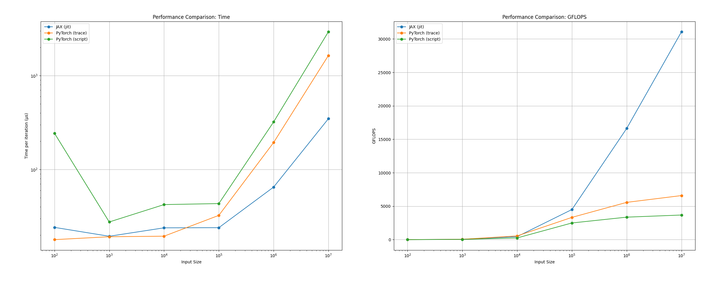
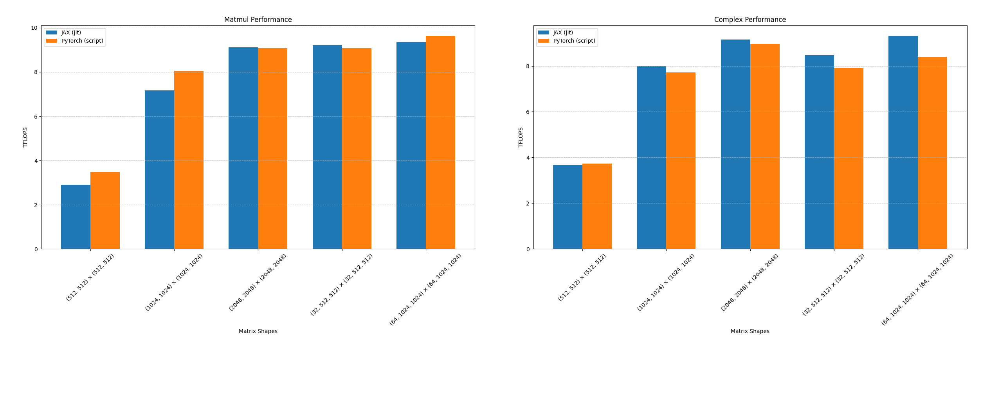

# PyTorch and JAX jitted performance comparison
I wondered what was faster when doing maths/matmul operations and found no good performance benchmarks, so I created this.  
The code was created mainly with Claude Sonnet 3.5 because I'm lazy.

These are the results:

